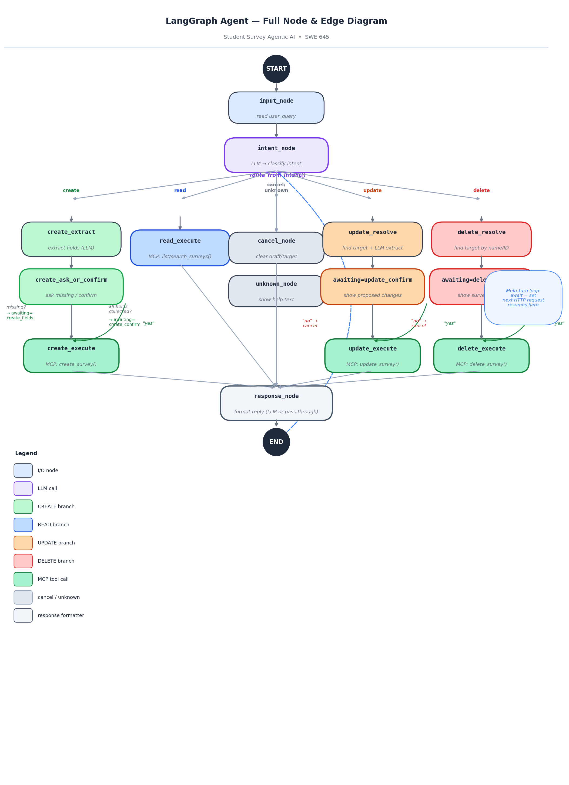

# Agentic AI Student Survey System

> **SWE 645 — Extra Credit Assignment**  
> Extends the HW3 Student Survey app with a LangGraph AI agent + FastMCP tool layer.

---

## What This Is

A full-stack student survey application where users can manage surveys either through:
- **React forms** (traditional CRUD UI)
- **AI chat interface** (natural language via LangGraph agent)

The AI agent understands plain English commands like _"Delete John Doe's survey"_ or _"Show all students who liked the dorms"_ and executes them safely — with confirmation before any destructive operation.

---

## Architecture

```
React Chat UI  ──POST /agent/query──►  LangGraph Agent (Claude Haiku 4.5)
React Form UI  ──POST /surveys/──────►  FastAPI REST API
                                              │
                                    FastMCP Tool Server
                                              │
                                         SQLite / MySQL RDS
```

Three Kubernetes pods deployed via Helm:

| Pod | Technology | Port |
|-----|-----------|------|
| Frontend | React 19 + Nginx | 80 |
| Agent | LangGraph + FastAPI | 9000 |
| Backend | FastAPI + FastMCP | 8000 |

---

## LangGraph Flow



### Nodes (13 total)

| Node | Role |
|------|------|
| `input_node` | Extract `user_query` from message history |
| `intent_node` | Claude Haiku classifies: create / read / update / delete / confirm / cancel / unknown |
| `create_extract` | LLM extracts survey fields from message |
| `create_ask_or_confirm` | Ask for missing fields or show confirmation summary |
| `create_execute` | MCP: `create_survey()` |
| `read_execute` | MCP: `list_surveys()` or `search_surveys()` |
| `update_resolve` | LLM identifies target + extracts changes |
| `update_execute` | MCP: `update_survey()` |
| `delete_resolve` | LLM identifies target survey by name/ID |
| `delete_execute` | MCP: `delete_survey()` |
| `cancel_node` | Clears pending state |
| `unknown_node` | Returns help text |
| `response_node` | Formats final reply (LLM or pass-through) |

---

## MCP Tools

All 6 tools defined in `backend/mcp_tools.py`, served at `http://backend:8000/mcp`:

| Tool | What it does |
|------|-------------|
| `create_survey` | Insert new survey record |
| `list_surveys` | Return all surveys |
| `get_survey_by_id` | Fetch single record by ID |
| `search_surveys` | Filter by name, city, date, recommendation, etc. |
| `update_survey` | Patch one or more fields |
| `delete_survey` | Delete record (agent confirms before calling) |

---

## Project Structure

```
hw3-student-survey/
├── frontend/              # React 19 + Vite + Nginx
│   ├── src/components/
│   │   ├── AISurveyAssistant.jsx   # AI chat UI
│   │   ├── SurveyForm.jsx
│   │   ├── SurveyList.jsx
│   │   └── EditSurvey.jsx
│   └── Dockerfile
├── backend/               # FastAPI REST + FastMCP tool server
│   ├── main.py            # FastAPI app + MCP mount at /mcp
│   ├── mcp_tools.py       # 6 MCP tools (create/list/get/search/update/delete)
│   ├── models.py          # SQLModel Survey schema
│   ├── database.py        # SQLite / MySQL engine
│   └── Dockerfile
├── agent/                 # LangGraph AI agent
│   ├── app/
│   │   ├── graph.py       # StateGraph wiring (13 nodes, all edges)
│   │   ├── nodes.py       # Node functions (LLM calls + MCP calls)
│   │   ├── state.py       # AgentState TypedDict
│   │   ├── prompts.py     # System prompts for each LLM call
│   │   ├── mcp_client.py  # MCP connection + tool cache
│   │   └── main.py        # FastAPI wrapper + session store
│   └── Dockerfile
├── helm/student-survey/   # Kubernetes Helm chart
│   ├── Chart.yaml
│   ├── values.yaml
│   └── templates/
│       ├── backend-deployment.yaml
│       ├── agent-deployment.yaml
│       ├── frontend-deployment.yaml
│       ├── backend-service.yaml
│       ├── agent-service.yaml
│       ├── frontend-service.yaml
│       └── secrets.yaml
├── docs/
│   ├── langgraph-mermaid.png     # LangGraph node/edge diagram
│   ├── arch-diagram.png          # System architecture diagram
│   ├── design-document.pdf       # Full design document
│   └── flow-document.pdf         # End-to-end request flow document
└── docker-compose.yaml    # Local dev (all 3 services)
```

---

## Quick Start

### Local (Docker Compose)

```bash
# Build and run all 3 services
docker compose up --build

# Frontend:  http://localhost:3000
# Backend:   http://localhost:8000
# Agent:     http://localhost:9000
```

### Kubernetes (Helm)

```bash
# Build images
docker build -t student-survey-backend ./backend
docker build -t student-survey-agent   ./agent
docker build -t student-survey-frontend ./frontend

# Deploy
helm install student-survey ./helm/student-survey \
  --set secrets.anthropicApiKeyB64=$(echo -n 'your-key' | base64)

# Check pods
kubectl get pods

# Access frontend
kubectl port-forward svc/student-survey-frontend 3000:80
```

---

## Environment Variables

| Variable | Service | Default | Description |
|----------|---------|---------|-------------|
| `ANTHROPIC_API_KEY` | Agent | — | Required — Claude API key |
| `DATABASE_URL` | Backend | `sqlite:///./test.db` | SQLite or MySQL connection string |
| `MCP_SERVER_URL` | Agent | `http://localhost:8000/mcp` | Backend MCP endpoint |
| `AGENT_PORT` | Agent | `9000` | Port agent listens on |

---

## Tech Stack

| Layer | Technology |
|-------|-----------|
| Frontend | React 19, React Router, Axios, Vite, Nginx |
| AI Agent | LangGraph, LangChain, Claude Haiku 4.5, FastAPI |
| Tool Server | FastMCP 2.10+, langchain-mcp-adapters |
| Backend ORM | SQLModel (SQLAlchemy + Pydantic) |
| Database | SQLite (dev) / MySQL 8 on AWS RDS (prod) |
| Containers | Docker, Docker Compose |
| Orchestration | Kubernetes, Helm 3 |

---

## How the Agent Works

1. User types in chat → React POSTs to `POST /agent/query`
2. FastAPI loads session state (awaiting, draft_survey, etc.)
3. LangGraph runs: `input → intent → [branch] → response`
4. Branch nodes call MCP tools on the backend via HTTP
5. For destructive ops (create/update/delete): agent asks for confirmation before executing
6. `awaiting` field persists across turns so multi-step flows work across HTTP requests

---

## Team

**SWE 645 — Agentic AI Extension**  
Mann Desai · April 2026
Aakash Patil 
Tisha Shah
Aditya Raj
Yash Koli
